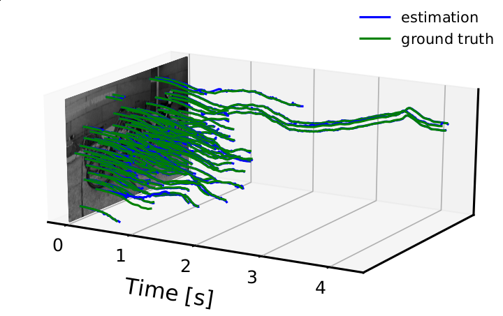
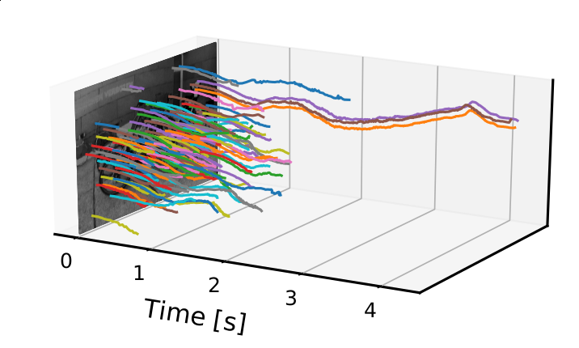
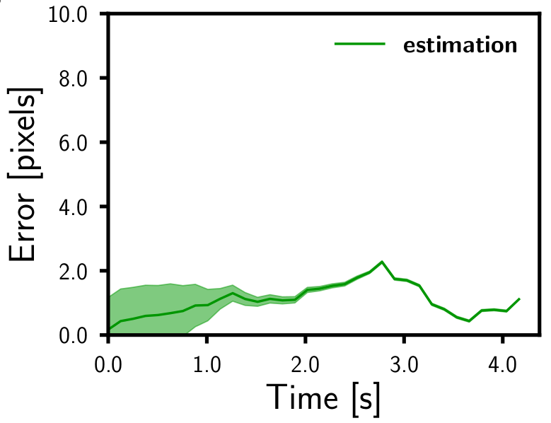
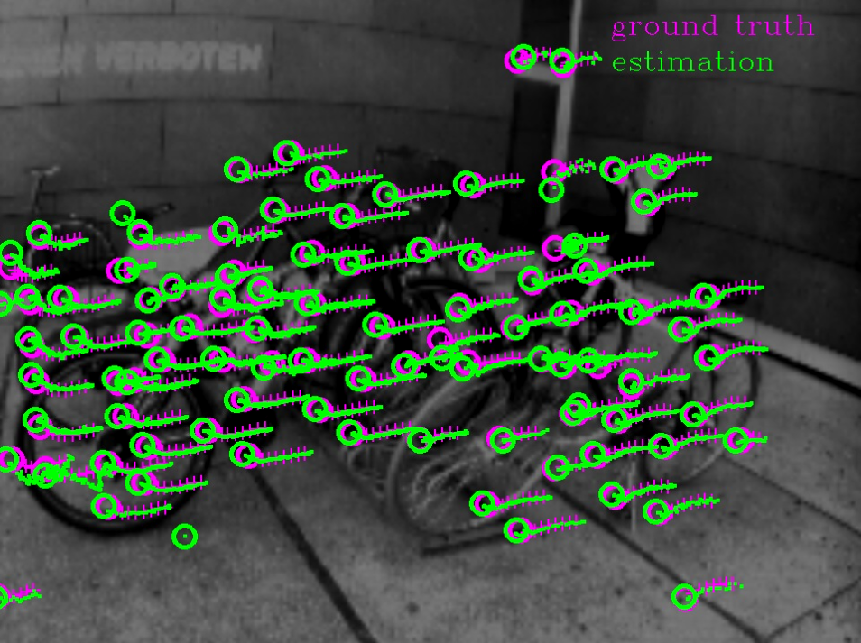
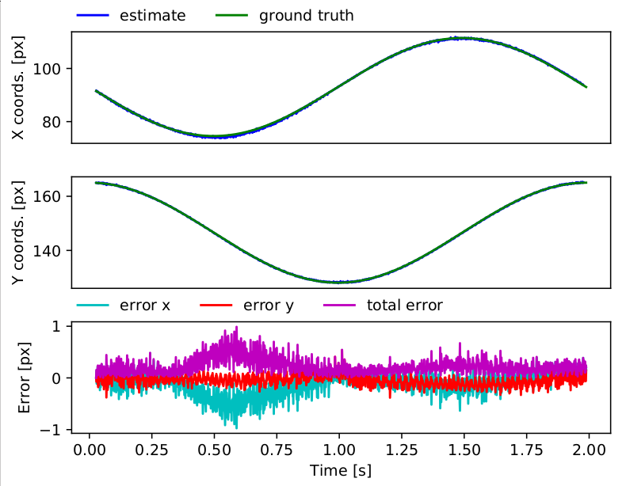
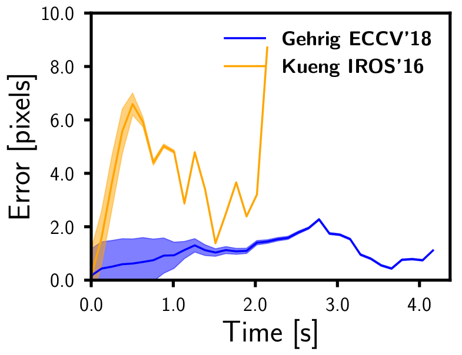

# Feature Tracking Analysis
[](https://youtu.be/ZyD1YPW1h4U)

This repository implements the method for event-based feature tracking evaluation, used in our 2019 IJCV paper [**EKLT: Asynchronous, Photometric Feature Tracking using Events and Frames**](http://rpg.ifi.uzh.ch/docs/IJCV19_Gehrig.pdf) by Daniel Gehrig, [Henri Rebecq](http://henri.rebecq.fr), [Guillermo Gallego](http://www.guillermogallego.es), and [Davide Scaramuzza](http://rpg.ifi.uzh.ch/people_scaramuzza.html).
Also check out our feature tracking evaluation package [here](https://github.com/uzh-rpg/rpg_feature_tracking_analysis).

## Citation

If you use this code in an academic context, please cite the following paper:

Daniel Gehrig, Henri Rebecq, Guillermo Gallego, Davide Scaramuzza, "EKLT: Asynchronous Photometric Feature Tracking using Events and Frames", International Journal of Computer Vision (IJCV), 2019
```bibtex
@Article{Gehrig19ijcv,
  author = {Daniel Gehrig and Henri Rebecq and Guillermo Gallego and Davide Scaramuzza},
  title = {EKLT: Asynchronous Photometric Feature Tracking using Events and Frames},
  booktitle = {Int. J. Comput. Vis. (IJCV)},
  year = {2019}
}
```

## Overview  

This repository implements the following two methods for evaluating ground truth feature tracks:

* KLT-based feature tracking on frames synchronized with the events.
* Feature tracking based on reprojection of landmarks

This package handles the details of aligning feature tracks and initializing KLT features for the user and 
offers the following functionality:

* Evalutate your feature tracks using one of the methods above
* Generate paper-ready plots of tracking error over time
* Generate 3d space-times plots of the feature tracks
* Generate video of feature tracks
* Compare your feature tracks against other methods
* Plots of tracking error for individual features


1. [Installation](#installation)
2. [How it Works](#how-it-works)
3. [Preparing the Data](#preparing-the-data)
4. [Running the Evaluation](#running-the-evaluation)
5. [Compare Against other Methods](#compare-against-other-methods)
6. [Visualize the Tracks](#visualize-the-tracks)
7. [Plotting Data for Individual Tracks](#plotting-data-for-individual-tracks)
8. [Try it Out](#try-it-out)

## Installation

The package is written in `python2`, tested on Ubuntu 18.04 and
it requires an installation of ROS.
To install, clone the repo and install the dependencies:
```bash
git clone feature_tracking_anlaysis
cd feature_tracking_analysis
virtualenv venv
source venv/bin/activate
pip install -r requirements.txt
```
Here steps 3 and 4 are optional, and require the python `virtualenv` package which can be installed as follows:
 ```bash
pip install virtualenv
```

## How it Works

The evaluation of feature tracks can be split into roughly two steps: initialization of the ground truth tracker and tracking.

For KLT-based ground truth, the algorithm performs the following steps: 
1. for every feature track its initialization time is found
2. the first gray-scale frame at or after initialization is found
3. the x and y position of the feature is interpolated from the track, at the time of this frame.
4. the KLT tracker tracks this feature until it is lost, updating the template after each frame.

For reprojection based ground truth, the following steps are performed:
1. the initialization times and positions are found for each feature track
2. using interpolation the depths and poses at the time of each initialization are found.
3. using the poses, depths and camera calibration, the features are back-projected 
4. for each subsequent pose the landmarks are reprojected into the image, yielding feature tracks.
5. features are discarded whenever they leave the image.

Note that for reprojection based tracking we do not support camera distortions. This is usually not a 
problem since this tracking algorithm will be used mostly in simulation, where camera distortion can be 
controlled. In addition, occlusion based feature discarding is not supported. This means that tracking
 works best in convex scenes.
You may use the event camera simulator [ESIM](http://rpg.ifi.uzh.ch/esim) to generate your own evaluation sequences with ground truth depth maps and camera poses.

For more details concerning error and feature age calculation you can refer to the paper [here](http://rpg.ifi.uzh.ch/docs/ECCV18_Gehrig.pdf).

## Preparing the Data

The user must provide the feature tracks that are to be evaluated in form of a `.txt` file.
This file contains the position, feature id and timestamp of every feature update. Note that feature ids must be unique 
and the timestamps increasing. Subpixel resolution is supported.

```
# feature_id timestamp x y
25 1.403636580013555527e+09 125.827 15.615 
13 1.403636580015467890e+09 20.453 90.142 
...
``` 
The images, poses, depth_maps and camera info used for ground truth generation must be provided in form of a rosbag.
Images need to be in the `sensor_msgs/Image` message format, poses in the `geometry_msgs/PoseStamped` format and depth maps
in the `sensor_msgs/Image` format, encoded as a `CV_32F` image.

The information about the topics and rosbag is provided by the user with a configuration file `dataset.yaml`

```yaml
type: bag
name: relative/path/to/ros.bag  # relative path of bag

# For KLT based tracking 
image_topic: /dvs/image_raw  

# For reprojection based tracking
depth_map_topic: /dvs/depthmap
pose_topic: /dvs/pose
camera_info_topic: /dvs/camera_info

```

## Running the Evaluation

For feature tracks evaluation run the python script `evaluate_tracks.py` 
    
    python evaluate_tracks.py --error_threshold 10 --tracker_type KLT --file rel/path/to/tracks.txt --dataset rel/path/to/dataset.yaml --root path/where/to/find.bag

this script creates two files `tracks.txt.gt.txt` and `tracks.txt.errors.txt` which contain the ground truth tracks and tracking errors
respectively.
In addition, it creates a folder `results` in the base folder of the tracks file, where average tracking error and feature age are stored.
These can be found in `results/errors.txt` and `results/feature_age.txt` respectively.

### Parameters

* `tracker_type`:
    * `KLT`: uses a KLT tracker on frames
    * `reprojection`: tracks points by back-projecting them and reprojecting them with given poses.
* `error_threshold`: Used only during visualization and plotting. Discards features if their tracking error exceeds this threshold.

The specific tracker parameters can also be provided manually through the `--tracker_params` parameter which must 
point to a `.yaml` file of the following form

```yaml
type: KLT # 'KLT' or 'reprojection', type of algorithm used

# parameters only for KLT
window_size: 21 # window size of tracked patch
num_pyramidal_layers: 1 # number of layers in pyramidal search
```

If no parameters are given, they are read from `config/`.

Optionally the following flags can be used:
* `plot_3d`: Generates 3D plots of the tracks in space-time.
* `plot_errors`: Generates plots of the tracking error and percentage of tracked features over time.
* `video_preview`: Generates a preview video of the feature tracks with ground truth.

These files will be also be written into the `results` folder and will be stored as 
`results/3d_plot.pdf`, `results/3d_plot_with_gt.pdf`, `results/errors.pdf` and `results/preview.avi`. Previews
can be seen in the figures below.

Note that if `plot_3d` or `video_preview` is set, an image topic must be provided in the dataset configuration file.

|||
|:---:|:---:|
|||

## Compare Against other Methods

In addition to the evaluation script, this package also provides useful functionality to compare different tracking methods. 
The methods are compared in terms of their tracking error over time, as well as average tracking error and feature age.

In order to do a comparison, a configuration file must be provided in the following form:

```yaml
- Our_method:
    - [0, 255, 255]
    - tracks/our_method/
- Other_method:
    - [0, 255, 255]
    - tracks/other_method/
...
```

Here the keys correspond to the labels associated with different methods (note underscores will be replaced with spaces).
The first entry under a key is the color (RGB) of the method in the final plot. The second element corresponds to the folder containing
a `tracks.txt` file.

To compare different methods call the following script:

    python compare_tracks.py --error_threshold 10 --root rel/path/to/tracks/directories --config rel/path/to/confing.yaml --results_directory rel/path/to/output/

This script will output the following files into `rel/path/to/output/`:
* `errors.pdf`: A plot comparing tracking error over time for the methods in the config.
* `errors.txt`: A table of the average tracking errors for different methods.
* `feature_age.txt`: A table of the average feature ages for different methods.

As before `--error_threshold` discards tracks if their tracking error exceed this threshold.

## Visualize the Tracks


This package has the functionality to visualize your feature tracks in an interactive manner using the `visualize.py` script.
To do this call the following script:

    python visualize.py --file rel/path/to/tracks.txt --dataset rel/path/to/ros.bag /image/topic
    
This starts an interactive GUI for visualizing the tracks found in `tracks.txt`, together with ground truth (if it exists in
the same folder).
You can interact with the visualization using the following keys:

| Key | Function |
| :---: | :---: |
|<kbd>space</kbd> or <kbd>p</kbd>| toggle pausing|
|<kbd>l</kbd>|toggle loop|
|<kbd>q</kbd>|quit| 
|<kbd>r</kbd>|reset to beginning|
|<kbd>d / a</kbd>|step forward / backward|
|<kbd>s / w</kbd>|step to beginning / end|
|<kbd>e / q</kbd>|increase / decrease track history|

### Parameters

For more fine-grained control of the visualization the following parameters can be used:
* `track_history_length`: length of the track history in seconds.
* `scale`: resizes the image to show tracks at subpixel accuracy.
* `framerate`: frame rate of the visualization
* `speed`: speed of the visualization
* `marker`: marker used for tracks. Needs to be either `circle` or `cross`.
* `error_threshold`: discards features if their tracking error is above a threshold.
* `crop_to_predictions`: crops ground truth tracks to the length of the corresponding predicted tracks.
* `video_file`: file to write video to.
## Plotting Data for Individual Tracks



For a more detailed analysis of the feature tracks this package provides the functionality
to plot the tracking error for individual tracks. This can be done with the script `plot_track.py`.

    python plot_track.py --file path/to/tracks.txt --id 1
    
This script will create a folder called `results/tracks` in the folder where the tracks are found and saves the 
plot as `track_{track_id}.pdf`. Optionally, all feature tracks can be plotted by setting `id` to -1.

The plots contain the following:

* x coordinate of ground truth and estimated track
* y coordinate of ground truth and estimated track
* x and y tracking error, as well as total (euclidean) tracking error.
  
## Try it Out 

If you want to try out the functionalities provided you can download example tracks and datasets from [here](http://rpg.ifi.uzh.ch/datasets/feature_tracking_analysis_example.zip).
Download the data and unzip it into your `/tmp/` folder 

```bash
unzip ~/Downloads/feature_tracking_analysis_example.zip -d /tmp/
```

The resulting `example` folder contains the following directories:
* `bags`: contains datasets for evaluation
* `tracks`: contains three subfolder with tracks 
    * `simulation_3planes`: tracks generated for simulated data by the tracker presented in Gehrig ECCV'18    
    * `bicycles_gehrig_eccv_18`: tracks generated for real data by the tracker presented in Gehrig ECCV'18    
    * `bicycles_kueng_iros_16`: tracks generated by the tracker presented in Kueng IROS'16
* `dataset_params`: contains configurations for the datasets in `bags`
* `comparison_params`: contains configurations for comparing the method in Kueng IROS'16 to the one in Gehrig ECCV'18
* `comparison_results`: folder that will be filled with output files

### Evaluation

In order to run an evaluation call

    python evaluate_tracks.py --error_threshold 10 --tracker_type KLT --file /tmp/example/tracks/bicycles_gehrig_eccv_18/tracks.txt --dataset /tmp/example/dataset_params/bicycles.yaml --root /tmp/example/bags --plot_3d --plot_errors --video_preview

This will generate ground truth using a KLT tracker on frames and store output files in the folder `/tmp/example/tracks/bicycles_gehrig_eccv_18/results`
Alternatively, reprojection based ground truth for the simulated dataset can be generated using the following command.

    python evaluate_tracks.py --error_threshold 10 --tracker_type reprojection --file /tmp/example/tracks/simulation_3planes/tracks.txt --dataset /tmp/example/dataset_params/simulation_3planes.yaml --root /tmp/example/bags --plot_3d --plot_errors --video_preview
    

### Comparison

Tracks using the method described in Kueng IROS'16 have also been generated for the `bicycles` dataset.
In order to compare them against the other method we first need to run an evaluation on them.

    python evaluate_tracks.py --error_threshold 10 --tracker_type KLT --file /tmp/example/tracks/bicycles_kueng_iros_16/tracks.txt --dataset /tmp/example/dataset_params/bicycles.yaml --root /tmp/example/bags --plot_3d --plot_errors --video_preview

Now both methods can be compared using the following script:

    python compare_tracks.py --error_threshold 10 --root /tmp/example/tracks/ --config /tmp/example/comparison_params/bicycles.yaml --results_directory /tmp/example/comparison_results

This command writes the comparison results in the folder `/tmp/example/comparison_results`. This script outputs a plot
showing tracking error over time which is shown below.



|Method | Tracking Error [px] | Feature Age [s]|
|:---:|:---:|:---|
 |Gehrig ECCV 18| 0.74|1.18|
 |Kueng IROS 16|3.59|0.56|
 
### Interactive Visualization
 
The interactive visualization for one of the tracks above can be started by using the following script
 
    python visualize.py --dataset /tmp/example/bags/bicycles.bag /dvs/image_raw --file /tmp/example/tracks/bicycles_gehrig_eccv_18/tracks.txt

### Plotting Tracks

Finally, individual tracks and tracking errors for these tracks can be plotted using the following script

    python plot_track.py --file /tmp/example/tracks/bicycles_gehrig_eccv_18/tracks.txt
    
This will generate the plots in `/tmp/examples/tracks/bicycles_gehrig_eccv_18/results/tracks/`.

